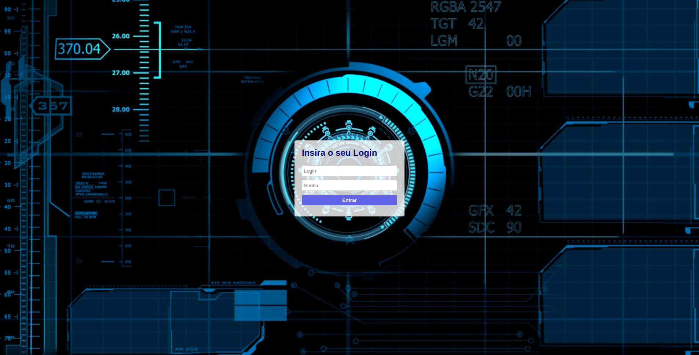

# Tela-de-login
--
 
Página de login simples usando HTML,CSS e um script embutido para teste de gereciamento de login e senha,com propriedades display flex.
  
*Imagem do Projeto*

  

Tecnologias utilizadas: 
 HTML
 CSS

  
Para ver o projeto funcionado clique [AQUI](https://wilgnerfrasao.github.io/Tela-de-login/)
